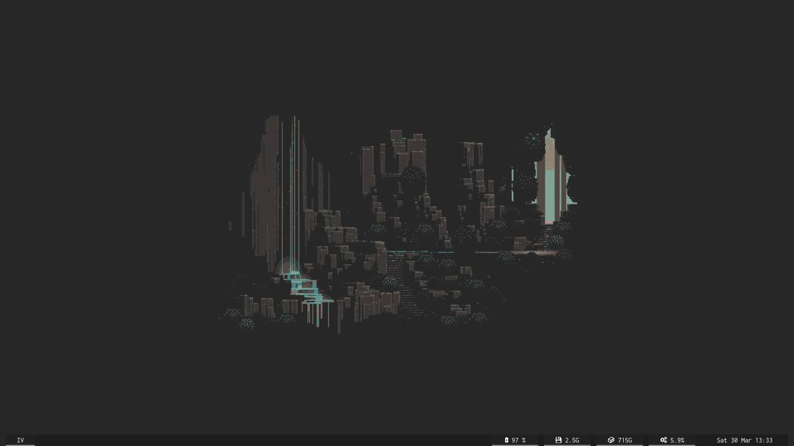
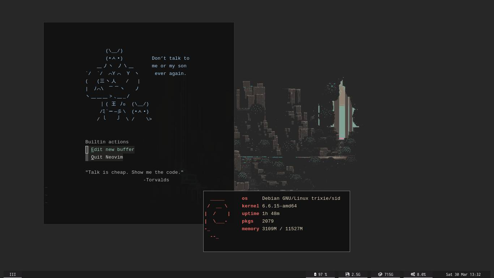

# .files





Personal dotfiles and general configuration files

## As for:

### `Neovim`

This version of my neovim config uses both the [paq-nvim](https://github.com/savq/paq-nvim) plugin manager and the native lsp engine (with [nvim-lspconfig](https://github.com/neovim/nvim-lspconfig)), so be sure to have paq set up before starting. These are my currently set up language servers, you will need to set these up beforehand:

- ccls
- gopls
- tsserver
- typst\_lsp

In the first run there will probably be a lot of red errors and panics exploding in your face. This is normal as you still haven't installed any plugin at all, so run:

```
:PaqInstall
```

And then reopen neovim or resource the config file.

### `Xournal++`

You probably want to have set up at least one toolbar configuration file before actually changing it to this one, to do so you can go to:

`View > Toolbars > Manage`

And add a custom one.

### `ST`

[My st distribution is currently maintained here](https://gitlab.com/PandaDiestro/st-distr)

### `dmenu`

I currently rely on dmenu for a lot of operations in my machines, I use it both as app launcher (j4-desktop-menu) and clipboard manager (clipmenu).

###### *currently a work in progress*
