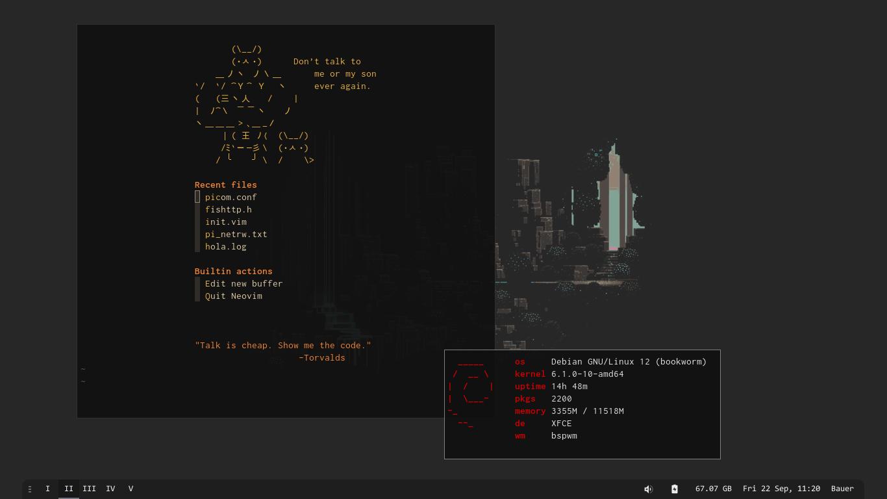

# .files




Personal dotfiles and general configuration files

## As for:

### `Neovim`

This version of my neovim init.vim uses both the [paq-nvim](https://github.com/savq/paq-nvim) plugin manager and [conqueror of completion](https://github.com/neoclide/coc.nvim) (*soon to be changed to the native lsp engine for performance reasons*), so be sure to have both of them set up before starting.

In the first run there will probably be a lot of red errors and panics exploding in your face. This is normal, you still haven't installed any plugin at all, so run:

```
:PaqInstall
```

And then reopen neovim or resource the config file. After that, you should change your `g:coc_node_path` to whatever the output of `where node` is (assuming you have a special node.js bin already installed, if you already have it in your `$PATH` then coc should automatically detect its location).

My currently installed lsp servers are:

1. coc-json
2. coc-tsserver
3. coc-r-slp
4. coc-pyright
5. coc-java
6. coc-go
7. coc-texlab
*ccls was set up as a separate bin, not as a coc plugin*
8. ccls

### `Xournal++`

You probably want to have set up at least one toolbar configuration file before actually changing it to this one, to do so you can go to:

`View > Toolbars > Manage`

And add a custom one.

### `ST`

This is a heavily patched gruvbox-ish st distribution which implements the patches at `./st/patches`

### `dmenu`

I currently rely on dmenu for a lot of operations in my machines, I use it both as app launcher (j4-desktop-menu) and clipboard manager (clipmenu).

###### *currently a work in progress*
